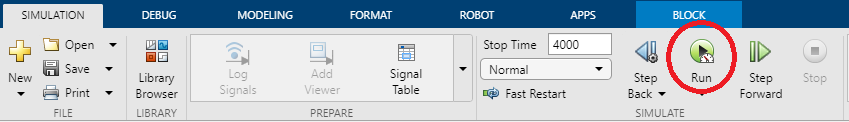
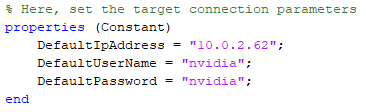
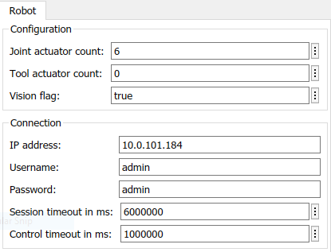
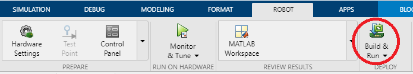

# Kortex System Object Setup Guide

## Overview

## Matlab Setup

1. Open the `mex-wrapper` sub-folder in Matlab
2. Add the `matlab_api` folder and its sub-folders to the Matlab path
3. Open the `example_model.slx` Simulink model

## Interpreted Execution

1. Run `compileKortexMex.m`
2. Edit both `kortex` and `kObjTrajectoryFeeder` Simulink objects with Kinova Robot information
3. In Simulink, click on `Run` in the Simulate tab

    

## ROS2 Code Generation on Jetson Target

1. Edit the `rosTargetPreferences.m` file with Jetson parameters

    

2. Run `configKortexModelROS2.m`
3. Edit both `kortex` and `kObjTrajectoryFeeder` Simulink objects with Kinova Robot information

    

4. Open the Robot tab in Simulink
5. Select the ROS2 framework
6. Click on `Build & Run`

    

The `Build & Run` will additionally do the following:

1. Transfer the generated ROS2 package directly on the Jetson target
2. Compile on the Jetson target (using Colcon tools)
3. Run the compiled ROS2 package on the Jetson Target
