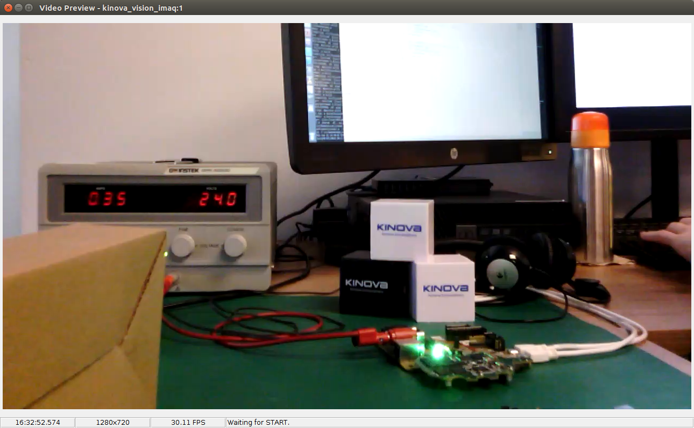
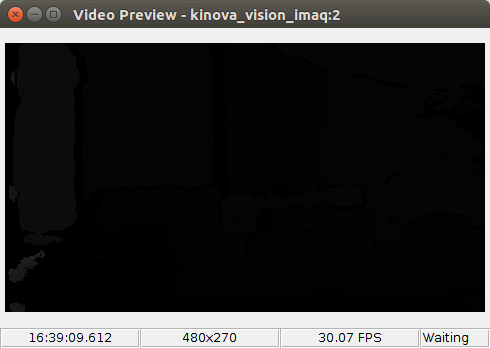
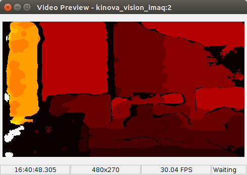
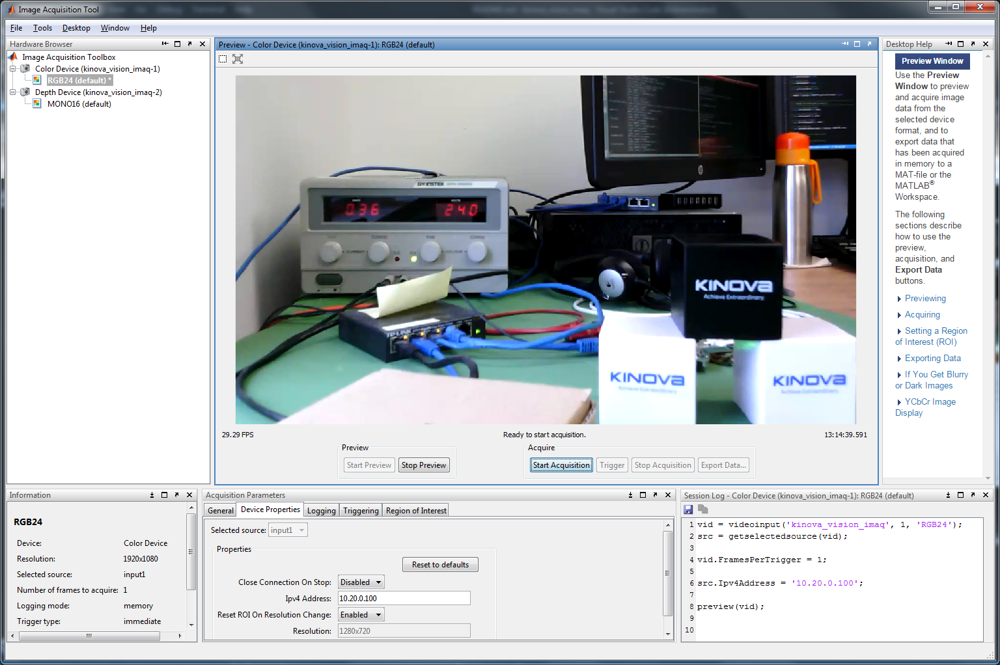
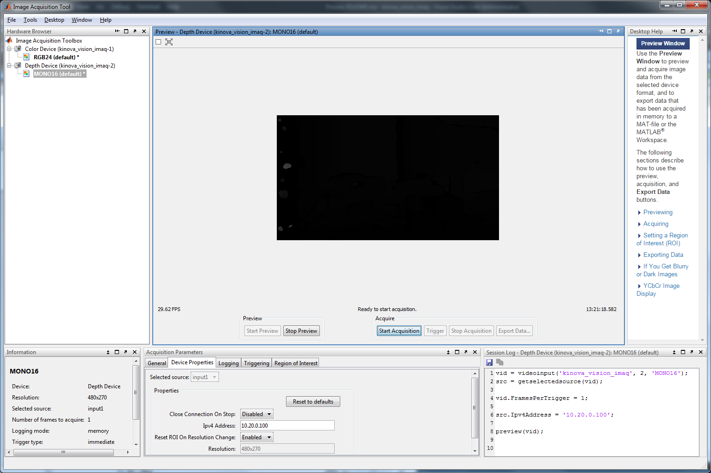

# Vision Module MATLAB Image Acquisition Toolbox Adaptor

## Overview
This MATLAB adaptor allows access to the Kinova vision module depth and color streams in MATLAB via the Image Acquisition Toolbox.

## System Requirements
Development and testing was done under:
- Windows 7 (64-bit) and 
- Ubuntu 16.04 (64-bit).

### MATLAB
1. [MATLAB](https://www.mathworks.com/products/matlab.html) version 9.5 (R2018b)
2. Image Acquisition Toolbox (selected during MATLAB installation)
3. Image Processing Toolbox (selected during MATLAB installation)

### Runtime Dependencies
#### Windows Operating System
**Note:** You don't need to install the following GStreamer 1.0 Runtime Binaries if you select to install the GStreamer component when installing the Vision Module MATLAB Image Acquisition Toolbox Adaptor. Refer to section **Installation Instructions** below.

* GStreamer 1.0 Runtime Binaries:
  * [gstreamer-1.0-msvc-x86_64-1.15.2.msi](https://gstreamer.freedesktop.org/data/pkg/windows/1.15.2/gstreamer-1.0-msvc-x86_64-1.15.2.msi)
* Environment variable `PATH` must include GStreamer's binaries folder
  * Typically `C:\gstreamer\1.0\x86_64\bin`

Note: When installing GStreamer, it's recommended to select the **Complete** installation.

#### Linux Operating System
 GStreamer 1.0 and Glib 2.0 Runtime binaries:
```sh
sudo apt install libgstreamer1.0-0 gstreamer1.0-plugins-base gstreamer1.0-plugins-good gstreamer1.0-libav
sudo apt install libglib2.0-0
```

## Installation Instructions
You can access the latest release of the Vision Module MATLAB Image Acquisition Toolbox Adaptor [here](https://artifactory.kinovaapps.com/artifactory/generic-local-public/kortex/matlab/vision/1.0.0/matlab_vision_imaq_1.0.0.zip) on the Kinova Artifactory.

Uncompress the archive to access either the Windows or Linux binaries:

### Windows Operating System

Under the `windows/installer` folder, you will find the installer executable.

This application, `kinova_vision_imaq_<version>.exe`, installs the following components:
* The Kinova Vision Module MATLAB Image Acquisition Toolbox Adaptor library (i.e. the product)
* [Optionally] The required GStreamer libraries (see note below)
* [Optionally] The Windows redistribution libraries installer (runs automatically)

**Note:** If GStreamer version 1.15.2 or more recent is already installed on your system, you don't need to install the GStreamer libraries component.

The \<version\> field indicates the version of the product.

#### Requirements
You need to have administration privileges to run this installer.
This is required to update the Windows registry, as well as optionally update environment variables.

This installer can only be run on a Windows 64-bit machine.

#### System Modifications
##### Windows Registry
The installation information is stored in the Windows registry for the local machine (HKLM).

This makes the application visible in the "Program and Feature" control panel, allowing you to uninstall the application if required.

##### Environment Variables
If the GStreamer libraries component is installed, the following environment variables are affected.
* User environment: `GST_PLUGIN_SYSTEM_PATH` (added if not already existing)
* System environment: `PATH`

For both variables, the path to the installed GStreamer libraries is added. Upon uninstalling the application, that path is removed from these environment variables.

### Linux Operating System

Under the `linux/lib` folder, you will find the adaptor library.

## Usage
1. Start MATLAB
2. In the **Command Window**, register the adaptor library (you will only have to do this once):

```matlab
imaqregister('<full/path/to/kinova_vision_imaq library>');
```

**Note:**
* Under the Windows Operating System, the library file is `kinova_vision_imaq.dll`
* Under the Linux Operating System, the library file is `libkinova_vision_imaq.so`

### Available Devices
| Device ID | Stream | Format |
| --------- | ------ | ------ |
| 1         | Color  | RGB24  |
| 2         | Depth  | MONO16 |

### Device Properties
| Property                       | Access     | Default      | Description                                                  |
| --------                       | ------     | -------      | -----------                                                  |
| Close Connection On Stop       | Read/Write | Disabled     | Close stream connection upon stopping a capture (see Note 1) |
| Ipv4 Address                   | Read/Write | 192.168.1.10 | IP address to reach the Vision module via the arm            |
| Reset ROI On Resolution Change | Read/Write | Enabled      | Reset the ROI upon a stream resolution change (see Note 2)   |
| Resolution                     | Read Only  | N/A          | Indicates the stream resolution                              |

**Note 1:**

When we close the stream connection, we use the GStreamer library to change the pipeline state to `READY`. Unfortunately, under **Linux**, this doesn't always send a `TEARDOWN` request to the robot RTSP server. Without the `TEARDOWN` request, the RTSP server needs to wait for a 30-second inactivity timeout before internally closing the connection. As a result, if we open then close connections successively, after 2 connections we need to wait for 30 seconds. 

To avoid this issue, the default behavior is to leave the connection open upon stopping a capture (preview, acquisition). When you're ready to close a connection, simply set the proper device's property to 'Enabled' before stopping a capture.

**Note 2:**

When enabled, the Region of Interest (ROI) is reset to the maximum streamed image size upon a change in the resolution of the streamed video.

The detection is made when starting a capture (preview, acquisition), including the first one after a reset of the adaptor.

### Operating From the Command Window
#### Setup
```matlab
% Resets image acquisition hardware and obtains information about image acquisition adaptors
imaqreset;
imaqhwinfo;
```

#### Display the Color Device Video
```matlab
% Note: For Linux, the adaptor name is libkinova_vision_imaq
vid1 = videoinput('kinova_vision_imaq', 1, 'RGB24');
vid1.FramesPerTrigger = 1;
src1 = getselectedsource(vid1);

% Optionally, view the adaptor version
imaqhwinfo(vid1)

% Optionally, change device properties
src1.CloseConnectionOnStop = 'Enabled';
src1.Ipv4Address = '10.20.0.100';
src1.ResetROIOnResolutionChange = 'Disabled';

% Optionally, change the Region of Interest
vid1.ROIPosition = [0 0 300 200];

preview(vid1);
closepreview(vid1);
delete(vid1);
```
<p align="left">  </p>

#### Display the Depth Device Raw Video
```matlab
% Note: For Linux, the adaptor name is libkinova_vision_imaq
vid2 = videoinput('kinova_vision_imaq', 2, 'MONO16');
vid2.FramesPerTrigger = 1;
src2 = getselectedsource(vid2);

% Optionally, view the adaptor version
imaqhwinfo(vid2)

% Optionally, change device properties
src2.CloseConnectionOnStop = 'Enabled';
src2.Ipv4Address = '10.20.0.100';
src2.ResetROIOnResolutionChange = 'Disabled';

% Optionally, change the Region of Interest
vid2.ROIPosition = [0 0 300 200];

preview(vid2);
closepreview(vid2);
delete(vid2);
```
<p align="left">  </p>

#### Display the Depth Device Colorized Video
```matlab
% Note: For Linux, the adaptor name is libkinova_vision_imaq
vid2 = videoinput('kinova_vision_imaq', 2, 'MONO16');
vid2.FramesPerTrigger = 1;
src2 = getselectedsource(vid2);

% Optionally, view the adaptor version
imaqhwinfo(vid2)

% Optionally, change device properties
src2.CloseConnectionOnStop = 'Enabled';
src2.Ipv4Address = '10.20.0.100';
src2.ResetROIOnResolutionChange = 'Disabled';

% Optionally, change the Region of Interest
vid2.ROIPosition = [0 0 300 200];

im = preview(vid2);
ax = im.Parent;
im.CDataMapping = 'scaled';
colormap(ax, hot);
ax.CLimMode = 'auto';
ax.CLim = [0 20];
closepreview(vid2);
delete(vid2);
```
<p align="left">  </p>

### Operating From the Image Acquisition Tool Window
1. From MATLAB' main window, click on the **Image Acquisition** button
2. In the `Image Acquisition Tool` window:

#### Display the Color Device Video
1. Select `RGB24 (default)` under `Color Device`
2. [Optionally] In the `Acquisition Parameters` view, select `Device Properties` and view / change some properties
3. [Optionally] In the `Acquisition Parameters` view, select `Region of Interest` and view / change the ROI
4. Click on `Start Preview`
<p align="left">  </p>

#### Display the Depth Device Raw Video
1. Select `MONO16 (default)` under `Depth Device`
2. [Optionally] In the `Acquisition Parameters` view, select `Device Properties` and view / change some properties
3. [Optionally] In the `Acquisition Parameters` view, select `Region of Interest` and view / change the ROI
4. Click on `Start Preview`
<p align="left">  </p>

## Troubleshooting
### Windows Operating System
#### Invalid Adaptor
When doing the `imaqregister` command, you may get an error about `... kinova_vision_imaq.dll is not a valid adaptor`. Make sure the install location of the GStreamer libraries component is in the system environment variable `PATH`.

If the location is already there, you might need to move it before other GStreamer librairies locations.
Note however that doing so might break compatibility with other applications using GStreamer.

#### Plugin not found
When doing the `imaqhwinfo` command, you may get an error about `Plugin '<plugin>' not found ...`. Make sure the install location of the GStreamer libraries component is both in the user environment `GST_PLUGIN_SYSTEM_PATH` and in the system environment variable `PATH`.

If the location is already there, you might need to move it before other GStreamer librairies locations.
Note however that doing so might break compatibility with other applications using GStreamer.

### Linux Operating System
#### Plugin not found
When doing the `imaqhwinfo` command, you may get an error about `Plugin '<plugin>' not found ...`. Make sure the required plugins are installed.
Refer to the above section **Runtime Dependencies**.

## Licensing
This MATLAB adaptor uses GStreamer to access the Kinova Vision module Depth and Color streams.
GStreamer uses the [LGPL](http://www.fsf.org/licenses/lgpl.html) license.
